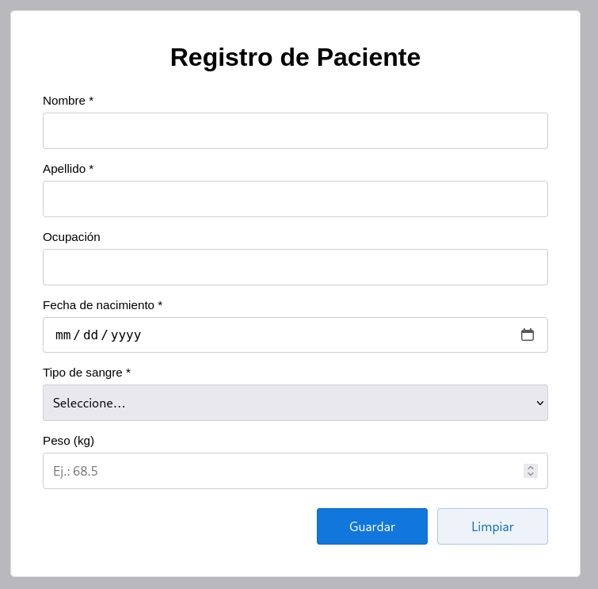
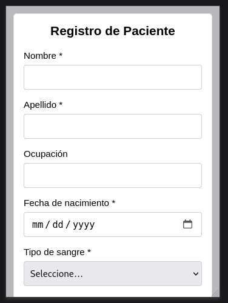

# 📋 Formulario de Registro de Paciente

Formulario web responsivo para el registro de información básica de pacientes en entornos médicos o clínicos.

## 🎯 Características

- ✅ Diseño **100% responsivo** adaptable a todos los dispositivos
- 📱 Optimizado para móviles, tablets y escritorio
- 🎨 Interfaz limpia y moderna
- ♿ Campos de formulario accesibles
- ⚡ Validación HTML5 integrada
- 🎭 Efectos hover y focus para mejor UX

## 📸 Vista Previa




## 🛠️ Tecnologías Utilizadas

- **HTML5** - Estructura semántica
- **CSS3** - Estilos y responsividad
  - Flexbox
  - Media Queries
  - Transiciones CSS

## 📊 Campos del Formulario

| Campo | Tipo | Requerido |
|-------|------|-----------|
| Nombre | Texto | ✅ Sí |
| Apellido | Texto | ✅ Sí |
| Ocupación | Texto | ❌ No |
| Fecha de Nacimiento | Fecha | ✅ Sí |
| Tipo de Sangre | Select | ✅ Sí |
| Peso (kg) | Número | ❌ No |

### Tipos de sangre disponibles:
- O-, O+
- A-, A+
- B-, B+
- AB-, AB+

## 🚀 Instalación y Uso

### Clonar el repositorio:
```bash
git clone https://github.com/GuidoFer/form-registro-paciente.git
```

### Navegar al directorio:
```bash
cd form-registro-paciente
```

### Abrir en el navegador:
Simplemente abre el archivo `index.html` en tu navegador favorito.

O usa un servidor local:
```bash
# Con Python 3
python -m http.server 8000

# Con Node.js (http-server)
npx http-server
```

Luego visita: `http://localhost:8000`

## 📱 Breakpoints Responsivos

| Dispositivo | Ancho | Características |
|-------------|-------|-----------------|
| Móvil pequeño | ≤ 360px | Padding reducido, texto compacto |
| Móvil estándar | 361px - 767px | Botones apilados verticalmente |
| Tablet | 768px - 1023px | Más espaciado, botones en línea |
| Desktop | ≥ 1024px | Diseño completo con espaciado amplio |

## 📂 Estructura del Proyecto
```
form-registro-paciente/
│
├── index.html          # Archivo HTML principal
├── css/
│   └── styles.css      # Estilos y media queries
└── README.md           # Documentación
```

## 🎨 Paleta de Colores

| Color | Hex | Uso |
|-------|-----|-----|
| Azul principal | `#1177dd` | Botón principal |
| Azul hover | `#0b6bcb` | Estado hover |
| Azul claro | `#eef3f9` | Botón secundario |
| Gris fondo | `#f5f5f7` | Fondo de página |
| Gris borde | `#cfcfd4` | Bordes de inputs |

## ✨ Características de Accesibilidad

- Etiquetas asociadas correctamente con inputs
- Atributos `required` para campos obligatorios
- Placeholders descriptivos
- Contraste de color adecuado
- Estados focus visibles

## 🌐 Navegadores Compatibles

- ✅ Chrome (últimas 2 versiones)
- ✅ Firefox (últimas 2 versiones)
- ✅ Safari (últimas 2 versiones)
- ✅ Edge (últimas 2 versiones)
- ✅ Opera (últimas 2 versiones)

## 📝 Próximas Mejoras

- [ ] Integración con backend (API REST)
- [ ] Validación JavaScript personalizada
- [ ] Almacenamiento en localStorage
- [ ] Exportar datos a PDF
- [ ] Modo oscuro
- [ ] Internacionalización (i18n)

## 🤝 Contribuciones

Las contribuciones son bienvenidas. Por favor:

1. Haz fork del proyecto
2. Crea una rama para tu feature (`git checkout -b feature/nueva-funcionalidad`)
3. Commit tus cambios (`git commit -m 'Agregar nueva funcionalidad'`)
4. Push a la rama (`git push origin feature/nueva-funcionalidad`)
5. Abre un Pull Request

## 📄 Licencia

Este proyecto está bajo la Licencia MIT - mira el archivo [LICENSE](LICENSE) para más detalles.

## 👤 Autor

**Guido Fer**

- GitHub: [@GuidoFer](https://github.com/GuidoFer)
- Proyecto: [form-registro-paciente](https://github.com/GuidoFer/form-registro-paciente)

## 🙏 Agradecimientos

- Diseño inspirado en principios de UI/UX modernos
- Iconos y recursos de la comunidad open source

---

⭐ Si te gustó este proyecto, ¡dale una estrella en GitHub!